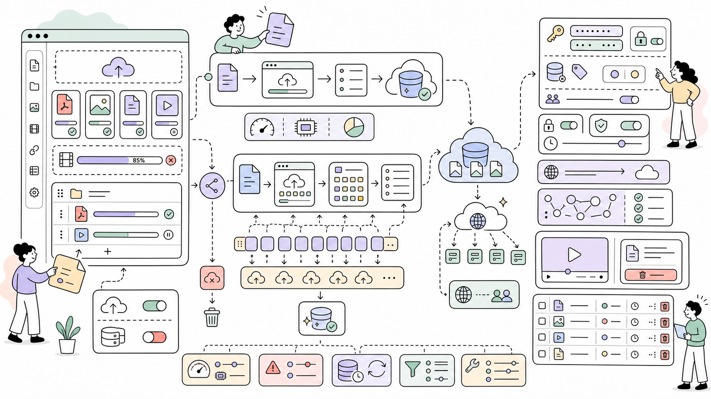

# FieldtypeFileB2 for ProcessWire

Store and serve files directly from Backblaze B2 Cloud Storage in ProcessWire. **Now supports files up to 700MB** with automatic chunked uploads.



**Author:** Maxim Semenov  
**Website:** [smnv.org](https://smnv.org)  
**Email:** [maxim@smnv.org](mailto:maxim@smnv.org)

If this project helps your work, consider supporting future development: [GitHub Sponsors](https://github.com/sponsors/mxmsmnv) or [smnv.org/sponsor](https://smnv.org/sponsor/).  

## Features

- 🚀 **Direct B2 Upload** - Files upload directly to Backblaze B2
- 📦 **Large Files Support** - Up to 700MB with automatic chunked upload
- ⚡ **Smart Upload** - Auto-switches between standard and chunked methods
- 💰 **Cost Effective** - $6/TB/month (5x cheaper than AWS S3)
- 🌐 **Custom Domain Support** - Use your own CDN domain
- ☁️ **Cloudflare Integration** - Free bandwidth via Bandwidth Alliance
- 🔒 **Public & Private Buckets** - Flexible access control
- 📁 **Multiple Files** - Support for repeater fields with multiple files
- 🎬 **Perfect for Video** - Tested with Plyr, Video.js and other players

## Requirements

- ProcessWire 3.x
- PHP 7.4+ (8.3 recommended)
- cURL extension enabled
- Backblaze B2 Account
- **For files >100MB:** Properly configured Nginx/PHP timeouts

## Installation

1. Download and extract to `/site/modules/FieldtypeFileB2/`
2. Go to **Modules → Refresh**
3. Install **FieldtypeFileB2**

## Configuration

### 1. Create Backblaze B2 Account

1. Sign up at [backblaze.com](https://www.backblaze.com/b2/sign-up.html)
2. Enable B2 Cloud Storage
3. Create a bucket (Public or Private)
4. Generate Application Key

### 2. Module Configuration

**Setup → Modules → Configure → InputfieldFileB2**
```
Backblaze Key ID: [Your Key ID]
Backblaze Application Key: [Your Application Key]
Bucket Name: your-bucket-name
Bucket ID: [Your Bucket ID]
Bucket Type: Public (or Private)
✅ Use SSL
❌ Store files locally (uncheck!)
Cache-Control max-age: 86400 (24 hours)
```

### 3. Create Field

1. **Setup → Fields → Add New Field**
2. Type: **FieldtypeFileB2**
3. Name: `b2_video` (or any name)
4. Add to your template

### 4. Web Server Optimization (CRITICAL for files >50MB)

#### PHP Settings (CloudPanel)

**Sites → Your Site → PHP Settings:**

```
PHP Version: 8.3
memory_limit: 512 MB
max_execution_time: 1800 (30 minutes)
max_input_time: 1800
post_max_size: 2 GB
upload_max_filesize: 2 GB
max_input_vars: 10000
```

**Additional Configuration Directives:**
```ini
date.timezone=UTC;
display_errors=off;
max_execution_time=1800;
max_input_time=1800;
```

#### Nginx Configuration (CloudPanel)

**Sites → Your Site → Vhost → Edit:**

Add these lines to **BOTH** server blocks (port 80/443 AND port 8080):

```nginx
server {
  # ... existing config ...
  
  # CRITICAL: File upload limits
  client_max_body_size 2048M;
  client_body_timeout 1800s;
  
  # ... rest of config ...
}

server {
  listen 8080;
  # ... existing config ...
  
  # CRITICAL: File upload limits
  client_max_body_size 2048M;
  client_body_timeout 1800s;
  
  location ~ \.php$ {
    # ... existing config ...
    
    # CRITICAL: PHP-FPM timeouts
    fastcgi_read_timeout 1800;
    fastcgi_send_timeout 1800;
  }
}
```

**After editing:**
```bash
sudo nginx -t          # Test config
sudo systemctl reload nginx
```

### 5. Optional: Custom Domain with Cloudflare

For free bandwidth and faster delivery:

**A. DNS Setup**

Add CNAME record:
```
Type: CNAME
Name: cdn
Value: f005.backblazeb2.com (use your region)
Proxy: Enabled (orange cloud)
```

**B. Cloudflare Transform Rule**

**Rules → Transform Rules → Create URL Rewrite Rule:**
```
Rule name: B2 CDN Path Rewrite

If incoming requests match:
  Field: Hostname
  Operator: equals
  Value: cdn.yourdomain.com

Then rewrite the path:
  Dynamic: concat("/file/YOUR-BUCKET-NAME", http.request.uri.path)
```

**C. Enable Custom Domain in Module**
```
✅ Use Custom Domain
Custom Domain: cdn.yourdomain.com
```

## How It Works

The module automatically chooses the best upload method:

### Small Files (< 50MB)
```
Standard Upload:
1. Browser → Server (shows progress)
2. Server → B2 via streaming (no full-file memory load)
3. Success!
```

### Large Files (≥ 50MB)
```
Chunked Upload:
1. Browser → Server (shows progress)
2. Server → B2 in 10MB chunks:
   - Chunk 1/50 (10MB)
   - Chunk 2/50 (10MB)
   - ... continues ...
   - Chunk 50/50 (10MB)
3. B2 assembles file
4. Success! (or b2_cancel_large_file on any error)
```

**Benefits of Chunked Upload:**
- ✅ Low memory usage — file is streamed, never loaded whole into RAM
- ✅ More reliable for large files
- ✅ Incomplete uploads are automatically cancelled on error (no orphaned files billed on B2)
- ✅ Works around server limits

## Usage Examples

### Basic Usage
```php
<?php namespace ProcessWire;

// Single file
<?php if($page->b2_video): ?>
<video controls>
    <source src="<?= $page->b2_video->url ?>" type="video/mp4">
</video>
<?php endif; ?>

// Multiple files
<?php foreach($page->b2_video as $video): ?>
<video controls>
    <source src="<?= $video->url ?>" type="video/mp4">
</video>
<?php endforeach; ?>
```

### With Custom Domain (b2url property)
```php
<?php foreach($page->b2_video as $video): ?>
<video controls>
    <source src="<?= $video->b2url ?>" type="video/mp4">
</video>
<?php endforeach; ?>
```

### With Plyr Player
```html
<link rel="stylesheet" href="https://cdn.plyr.io/3.7.8/plyr.css">

<?php foreach($page->b2_video as $video): ?>
<video class="plyr-video" playsinline controls>
    <source src="<?= $video->b2url ?>" type="video/mp4">
</video>
<?php endforeach; ?>

<script src="https://cdn.plyr.io/3.7.8/plyr.polyfilled.js"></script>
<script>
    Plyr.setup('.plyr-video', {
        controls: ['play-large', 'play', 'progress', 'current-time', 
                   'mute', 'volume', 'fullscreen']
    });
</script>
```

### In Repeater Fields
```php
<?php foreach($page->videos as $item): ?>
    <h3><?= $item->title ?></h3>
    
    <?php foreach($item->b2_video as $video): ?>
    <video controls>
        <source src="<?= $video->b2url ?>" type="video/mp4">
    </video>
    <?php endforeach; ?>
<?php endforeach; ?>
```

## File Size Limits

| File Size | Upload Method | Chunks | Est. Time* |
|-----------|---------------|--------|-----------|
| < 50MB    | Standard      | 1      | 1-2 min   |
| 50-100MB  | Chunked       | 5-10   | 2-5 min   |
| 100-300MB | Chunked       | 10-30  | 5-10 min  |
| 300-500MB | Chunked       | 30-50  | 10-15 min |
| 500-700MB | Chunked       | 50-70  | 15-25 min |

*Times assume 10 Mbps upload speed and properly configured server

## Pricing Comparison

### Backblaze B2 + Cloudflare
- Storage: **$6/TB/month**
- Bandwidth: **$0** (free via Cloudflare)
- Transactions: **Free** (first 2,500/day)

**Example:** 500 GB storage + 5 TB bandwidth = **$3/month**

### AWS S3 (for comparison)
- Storage: **$23/TB/month**
- Bandwidth: **$90/TB**
- Transactions: **$0.005 per 1,000**

**Same usage:** 500 GB storage + 5 TB bandwidth = **$461.50/month**

💰 **You save 99% on bandwidth with Cloudflare!**

## Troubleshooting

### Files return 404

**Cause:** Files not uploaded to B2 or localStorage enabled

**Solution:**
1. Check if `localStorage` is disabled in module settings
2. Verify bucket is Public (or CORS configured for Private)
3. Check ProcessWire logs for upload errors
4. Confirm files exist in B2 bucket

### Upload freezes or times out

**Cause:** Insufficient server timeouts

**Solution:**
1. Verify Nginx timeouts are set (see configuration above)
2. Verify PHP timeouts are set (see configuration above)
3. Check server logs:
```bash
tail -f /var/log/nginx/error.log
tail -f /var/log/php8.3-fpm.log
```

### Large files (>100MB) fail to upload

**Cause:** Server resource limits or network issues

**Solution:**
1. **Increase timeouts** to 30 minutes (1800s)
2. **Check PHP memory:** Should be 512MB minimum
3. **Test network speed:** Upload may take time
4. **Check logs for specific error:**
```bash
tail -100 /var/log/nginx/error.log
```

### Video not playing

**Cause:** Codec compatibility or CORS issues

**Solution:**
1. Verify MP4 codec compatibility (H.264 video, AAC audio)
2. Check CORS configuration (if private bucket)
3. Confirm file uploaded with correct Content-Type
4. Test direct B2 URL in browser

### 502 Bad Gateway or 504 Gateway Timeout

**Cause:** Nginx or PHP-FPM timeout

**Solution:**
```nginx
# In Nginx vhost:
fastcgi_read_timeout 1800;
client_body_timeout 1800s;

# In PHP settings:
max_execution_time = 1800
```

### Memory exhausted error

**Cause:** Conflict with other memory-intensive plugins

**Solution:**
1. Increase PHP memory_limit to 512MB
2. Since v1.1 the module streams files — it never loads a full file into RAM for either standard or chunked uploads
3. If error persists, check for other memory-intensive plugins running in the same request

## CORS Configuration

For cross-domain requests or private buckets:

```json
[
  {
    "corsRuleName": "downloadFromAnyOrigin",
    "allowedOrigins": ["https://yourdomain.com"],
    "allowedOperations": ["b2_download_file_by_name"],
    "allowedHeaders": ["*"],
    "exposeHeaders": ["*"],
    "maxAgeSeconds": 3600
  }
]
```

## Best Practices

### For Production Use

1. **Use Custom Domain with Cloudflare** for free bandwidth
2. **Enable Cloudflare Caching** for faster delivery
3. **Set appropriate Cache-Control** headers (24-48 hours for videos)
4. **Use Public buckets** for simpler setup (unless security required)
5. **Disable localStorage** to use B2 storage
6. **Monitor B2 costs** in your Backblaze dashboard

### For Large Files (>100MB)

1. **Increase server timeouts** to 30 minutes (1800s)
2. **Test with smaller files first** to verify configuration
3. **Monitor logs** during upload to catch issues early
4. **Warn users** about upload time for large files
5. **Consider file size limits** in your UI

### Cloudflare Caching Optimization

**Page Rules:**
```
URL: cdn.yourdomain.com/*
Settings:
  - Cache Level: Cache Everything
  - Edge Cache TTL: 1 month
  - Browser Cache TTL: 4 hours
```

This will:
- Reduce B2 API calls to near zero
- Speed up video delivery worldwide
- Maximize free bandwidth usage

## Technical Details

### Chunked Upload Specs

- **Chunk Size:** 10MB
- **Threshold:** Files ≥ 50MB use chunked upload
- **Max File Size:** ~970GB (theoretical B2 limit: 10,000 chunks × 100MB)
- **Current Practical Limit:** 700MB (tested)

### B2 API Endpoints Used

- `b2_authorize_account` - Authentication (cached 23 h in WireCache)
- `b2_get_upload_url` - Standard uploads
- `b2_start_large_file` - Start chunked upload
- `b2_get_upload_part_url` - Get URL for each chunk
- `b2_finish_large_file` - Complete chunked upload
- `b2_cancel_large_file` - Cancel incomplete upload on error
- `b2_list_file_names` - File listing (for delete)
- `b2_delete_file_version` - Delete files

## Monitoring & Logs

### Check Upload Progress

ProcessWire logs show detailed upload progress:

```
Setup → Logs → messages

Standard upload:
"Starting standard upload for 45.23MB file"

Chunked upload:
"Starting chunked upload for 256.78MB file"
"Uploading 26 chunks of 10MB each"
"Uploaded chunk 1/26"
"Uploaded chunk 2/26"
...
"Successfully uploaded 26 chunks"
```

### Server Logs

```bash
# Nginx errors
tail -f /var/log/nginx/error.log

# PHP-FPM errors
tail -f /var/log/php8.3-fpm.log

# Follow both simultaneously
tail -f /var/log/nginx/error.log /var/log/php8.3-fpm.log
```

## Upgrade from Previous Versions

See [CHANGELOG.md](CHANGELOG.md) for version history and upgrade notes.

### Quick Upgrade

```bash
# Backup current module
cp -r /site/modules/FieldtypeFileB2 /site/modules/FieldtypeFileB2.backup

# Copy new files
cp -r FieldtypeFileB2/* /site/modules/FieldtypeFileB2/

# Refresh modules in ProcessWire
# Modules → Refresh
```

**Important:** v1.1+ requires updated Nginx/PHP settings for large files.

## License

MIT License - feel free to use commercially

## Credits

Developed for video hosting on [lqrs.com](https://lqrs.com)

Built with ProcessWire CMS and Backblaze B2 API

## Support

For issues and feature requests:
- GitHub Issues: [your-repo-url]
- ProcessWire Forum: [forum-link]

## Changelog

See [CHANGELOG.md](CHANGELOG.md) for detailed version history.

### Latest Changes (v1.1.0)

- ✅ `filesize` DB column upgraded to `BIGINT` — supports files ≥ 2 GB without overflow
- ✅ Incomplete large-file uploads are now automatically cancelled on error (`b2_cancel_large_file`)
- ✅ Streaming upload for standard files — no full-file memory load (`CURLOPT_INFILE` + `sha1_file()`)
- ✅ Auth token cached in WireCache for 23 h — one API call per day instead of one per request
- ✅ Correct B2 URL returned in AJAX response after upload
- ✅ Removed duplicate `b2url` hook registration
- ✅ `unlink` errors are now logged instead of silently suppressed

---

**Note:** This module is under active development. Always test with non-critical data first.
